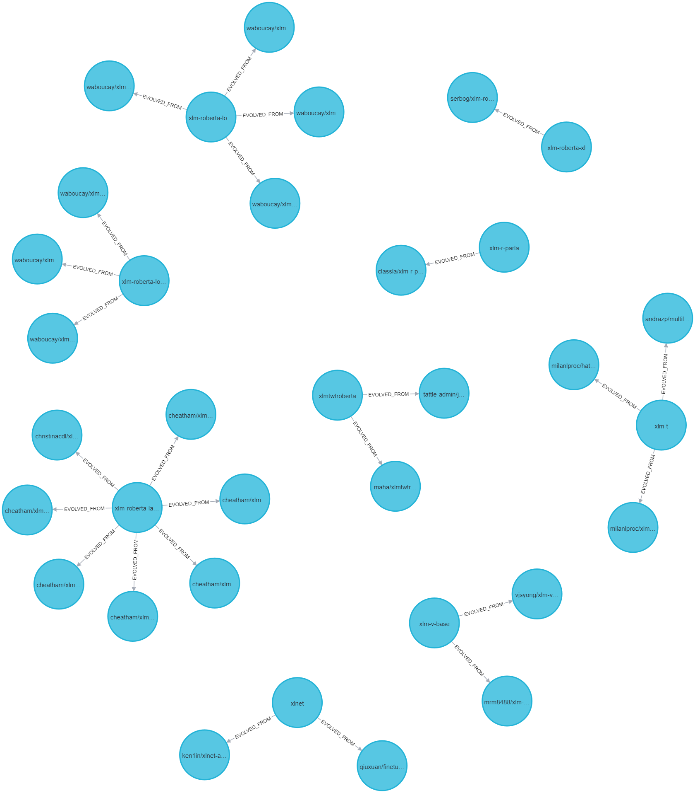

# Adversarial-Robustness-of-Open-source-AI-Models-and-Fine-Tuning-Chains

This project employs the Openattack library for conducting adversarial attacks on text classification models. Below is a description of the key files and their purposes within the project.
## Files and Their Roles
### adversarial_attacks.py
This script is responsible for executing adversarial attacks using the Openattack library and recording the attack outcomes.
### experiment_info.py
Contains detailed information about the test models and datasets used during the experimental phase of the project.
### prompt.py
Documents the prompt templates utilized when interacting with Large Language Models (LLMs) as part of our experimental setup.
### model_info.json
The JSON file includes upstream model information of the text classification models collected from the Hugging Face platform. You can use the NEO4J database to establish a visualized upstream and downstream model chain.

*This image shows the visualized upstream and downstream model chain established using the NEO4J database.*
### internal_threats_experimental_results.json
This JSON file logs the experimental results of two attack methodologies, TextBugger and GAN, specifically focusing on their volatility. It provides empirical evidence for the "internal threats" section of our research.
 
