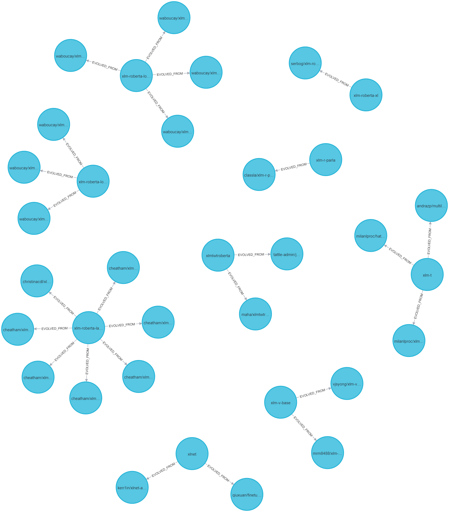
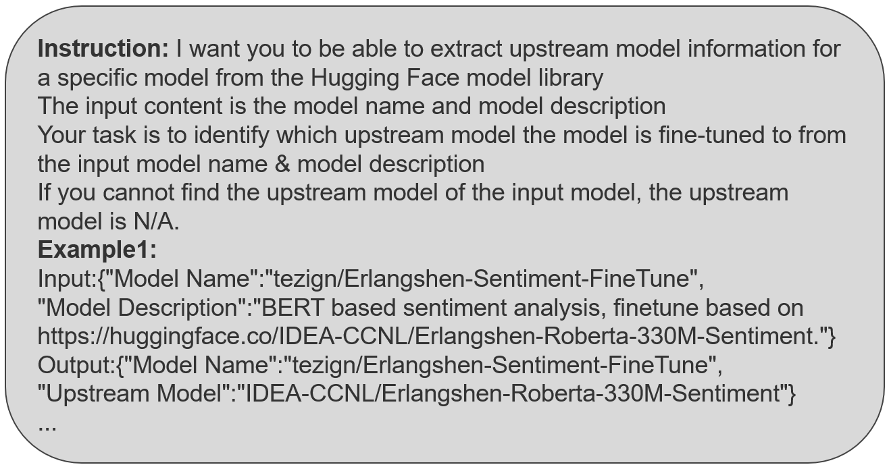

# Adversarial-Robustness-of-Open-source-AI-Models-and-Fine-Tuning-Chains

This project employs the Openattack library for conducting adversarial attacks on text classification models. Below is a description of the key files and their purposes within the project.
## Files and Their Roles
### adversarial_attacks.py
This script is responsible for executing adversarial attacks using the Openattack library and recording the attack outcomes.
### experiment_info.py
Contains detailed information about the test models and datasets used during the experimental phase of the project.
### prompt.py
Documents the prompt templates utilized when interacting with Large Language Models (LLMs) as part of our experimental setup.
### model_info.json
The JSON file includes upstream model information of the text classification models collected from the Hugging Face platform. You can use the NEO4J database to establish a visualized upstream and downstream model chain.

*This image shows the visualized upstream and downstream model chain established using the NEO4J database.*
### internal_threats_experimental_results.json
This JSON file logs the experimental results of two attack methodologies, TextBugger and GAN, specifically focusing on their volatility. It provides empirical evidence for the "internal threats" section of our research.
 
### LLM Robustness Evaluation

We conducted a preliminary test on the adversarial robustness of the Llama model in text classification tasks.

#### Experimental Setup

- **Model and Platform**: We chose Huggingface's official platform, HuggingChat, as the experimental platform. For the model, we selected the latest version of Llama, `Llama-3.2-11B-Vision-Instruct`, as the experimental model.

- **Experimental Prompt**:Please tell me whether the sentiment of this sentence is positive or negative. Just answer "positive" or "negative": SENTENCE

#### Experimental Method

**Sample Selection**: Randomly selected 20 adversarial examples (only those that were successfully attacked to generate adversarial samples) from each of the following six attack methods, totaling 120 samples:

- TextFooler
- TextBugger
- SCPN
- PWWS
- HotFlip
- GAN

**Testing Procedure**:

1. Input each original sample and its corresponding adversarial sample into the Llama model separately.
2. Compare the model's classification results:
   - If the results are different, the adversarial attack is considered successful.
   - If the results are the same, the attack is considered failed.

#### Experimental Results

| Attack Method  | Success Rate    | Successful Samples |
| -------------- | --------------- | ------------------ |
| TextFooler     | 8/20 (40%)      | 8 samples          |
| TextBugger     | 8/20 (40%)      | 8 samples          |
| SCPN           | 10/20 (50%)     | 10 samples         |
| PWWS           | 10/20 (50%)     | 10 samples         |
| HotFlip        | 8/20 (40%)      | 8 samples          |
| GAN            | 16/20 (80%)     | 16 samples         |
| **Average**    | **50%**         | **60/120 samples** |

#### Conclusion

The results indicate that current general-purpose large language models (such as Llama) still have significant room for improvement in adversarial robustness on text classification tasks.

### The Robustness Evaluation of the Downstream Fine-tuned LLM

We conducted a preliminary test on the transferability of adversarial robustness for Llama models in text classification tasks.

#### Experimental Setup

- **Model and Platform**:We deployed the `lamm-mit/Cephalo-Llama-3.2-11B-Vision-Instruct-128k` model locally for the transferability test. This model is fine-tuned from `meta-llama/Llama-3.2-11B-Vision-Instruct` and has a high number of downloads, indicating its widespread use.

- **Experimental Prompt**:Please tell me whether the sentiment of this sentence is positive or negative. Just answer "positive" or "negative": SENTENCE

#### Experimental Method

**Sample Selection**: The same set of test samples as used for the upstream model was selected, totaling 120 samples from the following attack methods:

- TextFooler
- TextBugger
- SCPN
- PWWS
- HotFlip
- GAN

**Testing Procedure**:

1. Input each original sample and its corresponding adversarial sample into the Llama model separately.
2. Compare the model's classification results:
   - If the results are different, the adversarial attack is considered successful.
   - If the results are the same, the attack is considered failed.

## Experimental Results

### Attack Success Rates

| Attack Method  | Attack Success Rate | Successful Samples |
| -------------- | ------------------- | ------------------ |
| TextFooler     | 50%                 | 10/20              |
| TextBugger     | 45%                 | 9/20               |
| SCPN           | 60%                 | 12/20              |
| PWWS           | 50%                 | 10/20              |
| HotFlip        | 45%                 | 9/20               |
| GAN            | 70%                 | 14/20              |
| **Average**    | **53.3%**           | **64/120 samples** |

### Transferability Rates

| Attack Method  | Transferable Rate    | Transferred Samples |
| -------------- | -------------------- | ------------------- |
| TextFooler     | 75%                  | 6/8                 |
| TextBugger     | 62.5%                | 5/8                 |
| SCPN           | 70%                  | 7/10                |
| PWWS           | 60%                  | 6/10                |
| HotFlip        | 75%                  | 6/8                 |
| GAN            | 81.25%               | 13/16               |
| **Average**    | **71.7%**            | **43/60 samples**   |

#### Conclusion

Experimental results show that fine-tuning does not alleviate the vulnerabilities of general-purpose large language models (such as Llama) on text classification tasks, and these adversarial risks may be passed on to downstream models.

## Fine-tuning Chains Illustration

### **Figure: Fine-tuning Chain**  

This figure illustrates the implicit upstream and downstream relationships between models under the fine-tuning paradigm. These relationships form what we call *fine-tuning chains*.

## Detailed Processes of Adversarial Attacks in NLP
In this section, we provide a comprehensive explanation of the general framework for adversarial attack techniques used in Natural Language Processing (NLP). 

To assess the adversarial robustness of AI models, developers typically employ some existing adversarial attack techniques, such as TextBugger and HotFlip for attacking.
**Figure Adversarial attack flow chart** shows the general framework for adversarial attack techniques.
For NLP tasks, adversarial attacks generally start with an *original dataset*.
For each sample in the original dataset (namely *Original Sample*), attack techniques identify vulnerable characters, words, or entities within the input text based on the feedback (e.g., gradient, logits, or probabilities) from the AI model under assessment.
After that, the attack techniques generate new samples, known as *adversarial samples*, through perturbing the vulnerable elements via character insertion, word substitution, etc.
Then, the generated adversarial samples are sent to the AI models under assessment.
The attack is considered successful if the assessed model produces the incorrect output.

### **Adversarial attack flow chart**  

## Upstream Model Extraction

To identify upstream models in detail, we first examine each model's Upstream'' attribute.
If it is not empty, we use this attribute as the index to retrieve the upstream model by matching each collected model's ``Model Name''.
Otherwise, we utilize the descriptions in the ``Model Card'' to identify the name of the upstream model for matching.
Considering that the names of upstream models are typically entities within the complex unstructured texts (as shown in **Figure Adversarial attack flow chart**), and traditional regular expression methods are ineffective for extracting such information or involving a large amount of labeled data for model training, we utilize ChatGPT, a popularly-used large language model (LLM),
guiding it with a carefully crafted prompt to extract the names of upstream models.
For a collected model, if there is no upstream model name extracted from the model descriptions, it is conisidered an isolated node recoreded in our dataset.
**Figure prompt** shows the crafted prompt, where the ``Instruction'' gives the task description and ``Example'' guides the LLM to understand the task it is dealing with and the corresponding input-output format through specific examples.

Regarding the bias introduced by ChatGPT, we manually evaluate the performance of identifying upstream model names. 
Initially, we randomly selected 100 models that are not annotated with upstream models in the ``Upstream'' attributes.
Three researchers manually annotate the upstream model names for each model respectively and establish a ground truth through discussion. 
Based on this, we evaluated the proportion of correct identification, i.e. accuracy rate, and the results showed an accuracy rate of 97\% on the 100 samples, demonstrating promising reliability of our automatic upstream model identification.

### **Prompt**  
